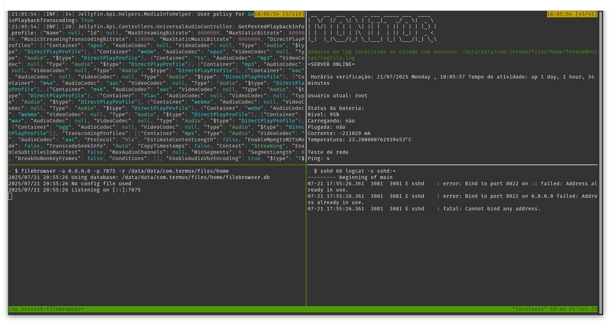

# TermuxServerLauncher
This code is for personal use, I don't know if it will be useful for other people. But anyway I hope it helps you!


This repository is available in: 🇺🇸 [English](README.md) <br>
Este repositório está disponível em: 🇧🇷 [Português](README.pt.md)  

# Termux Tmux Automation Script for Server Launching

This repository contains a Python script that automates the creation of a tmux session on Termux. The script sets up four tmux panes, where each pane runs a specific command. This can be useful for managing multiple tasks simultaneously in a terminal environment, such as starting Jellyfin, configuring FileBrowser, monitoring the system, and enabling SSH on Termux.

## How it works?

The code creates a new tmux session with four panes. Each pane automatically executes one of the following commands:

1. **Pane 1**: Runs the `jellyfin.sh` script located in `/data/data/com.termux/files/home/docker`.
2. **Pane 2**: Starts FileBrowser, listening on port 7075 and allowing access to the `/data/data/com.termux/files/home` directory.
3. **Pane 3**: Runs the `Monitor.sh` script located in `/data/data/com.termux/files/home/TermuxMonitor`.
4. **Pane 4**: Enables the SSH service and displays `sshd` logs using the `logcat` command.

## How to run?

1. Clone this repository to your local environment.
2. Make sure you have tmux installed on your Termux.
3. Run the Python script. It will create a tmux session and set up the panes automatically.

```bash
git clone https://github.com/Gabrick75/TermuxServerLauncher
cd TermuxServerLauncher
python3 init.py
```
## Dependencies

- `tmux`
- `Python 3`
- `FileBrowser`
- `Jellyfin`
- `SSH`

## Image




## License

This project is licensed under the MIT License - see the LICENSE file for details.
