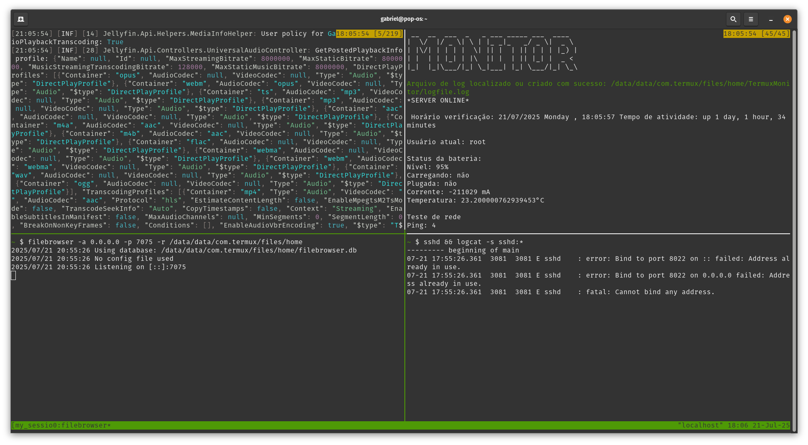

# TermuxServerLauncher
Este código é para uso pessoal, não sei se será útil para outras pessoas. Mas, de qualquer forma, espero que ajude você!

This repository is available in: 🇺🇸 [English](README.md) <br>
Este repositório está disponível em: 🇧🇷 [Português](README.pt.md)  

# Script de Automação Tmux no Termux para Lançamento de Servidor

Este repositório contém um script em Python que automatiza a criação de uma sessão tmux no Termux. O script configura quatro painéis tmux, onde cada painel executa um comando específico. Isso pode ser útil para gerenciar múltiplas tarefas simultaneamente em um ambiente de terminal, como iniciar o Jellyfin, configurar o FileBrowser, monitorar o sistema e habilitar o SSH no Termux.

## Como funciona?

O código cria uma nova sessão tmux com quatro painéis. Em cada painel, um dos seguintes comandos é executado automaticamente:

1. **Painel 1**: Executa o script `jellyfin.sh` localizado em `/data/data/com.termux/files/home/docker`.
2. **Painel 2**: Inicia o FileBrowser, ouvindo na porta 7075 e permitindo o acesso ao diretório `/data/data/com.termux/files/home`.
3. **Painel 3**: Executa o script `Monitor.sh` localizado em `/data/data/com.termux/files/home/TermuxMonitor`.
4. **Painel 4**: Habilita o serviço SSH e exibe logs do `sshd` usando o comando `logcat`.

## Como rodar?

1. Clone este repositório para o seu ambiente local.
2. Certifique-se de que o tmux esteja instalado no seu Termux.
3. Execute o script Python. Ele criará a sessão tmux e configurará os painéis automaticamente.

```bash
git clone https://github.com/Gabrick75/TermuxServerLauncher
python3 init.py
```
## Dependências

- `tmux`
- `Python 3`
- `FileBrowser`
- `Jellyfin`
- `SSH`

## Image



## Licença

Este projeto está licenciado sob a Licença MIT - veja o arquivo LICENSE para mais detalhes.
